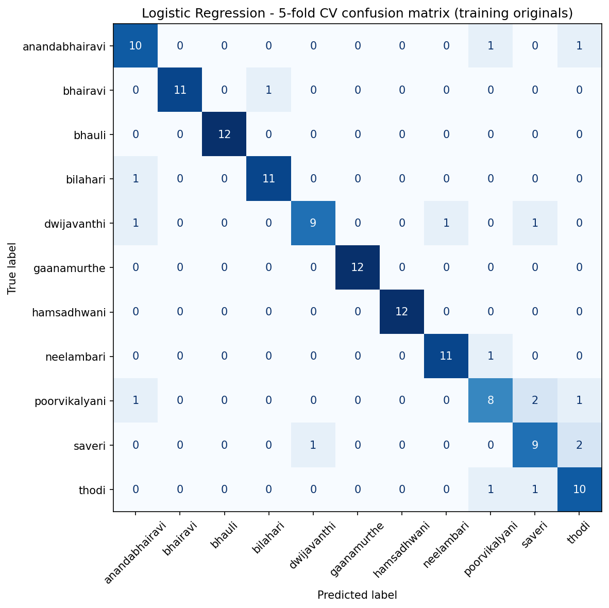

# Raga Multimodal Classifier

Multimodal recognition of Carnatic ragas from raw audio, combining classical machine learning with deep learning. This repository documents an end-to-end pipeline — from messy real-world audio to a cross-validated classifier with honest error analysis — built as a data science portfolio project.

> **Status:** Phase 1 (classical ML baseline) complete · Phase 2 (multimodal deep learning) in progress.

## Problem

A *raga* is the melodic framework of Indian classical music, defined by its set of swaras (notes) and its characteristic phrasing. Automatic raga recognition is a hard music-information-retrieval problem: different ragas can share note sets and differ mainly in ornamentation and melodic movement. This project builds a raga classifier and, in later phases, infers the emotional character associated with each raga.

## Dataset

**RaagaDhvani — Carnatic Raga Emotion Audio Dataset:** 11 Carnatic ragas performed as solo flute renditions, with per-raga emotion annotations and augmentation variants.

- 165 original recordings (15 per raga — perfectly balanced)
- 448 augmentation variants (pitch shift, time stretch, additive noise)
- Emotion mapped deterministically per raga (e.g., Bhairavi → devotion)

> Archana Priyadarshini. (2025). *Carnatic Raga Emotion Audio Dataset (RaagaDhvani)*. NMAMIT, Nitte (Deemed to be University). Licensed under CC BY-ND 4.0.

*Audio files are not redistributed in this repository, per the dataset license.*

## Methodology (Phase 1)

**Data cleaning.** Filenames encoded raga, emotion, and augmentation, but with real-world inconsistencies: spelling variants (Bowli/Bhauli, Nilambari/Neelambari, dhwijavanthi/Dwijavanthi) and inconsistent flute prefixes (\`F_\`, \`F\`, \`F_flute_\`). An alias-aware parser reached 100% parse coverage across all 613 files.

**Leakage-safe split.** Because augmented filenames do not preserve their source-recording identity, augmentations cannot be cleanly separated from originals at the recording level. The baseline therefore trains and evaluates on the 165 original recordings only, with a stratified 80/20 split. The 33-file test set was sealed and evaluated exactly once.

**Features.** Per-recording aggregated descriptors via \`librosa\`: 20 MFCCs (timbre), 12-bin chroma (pitch-class / tonal content), and spectral centroid, bandwidth, rolloff, zero-crossing rate, and RMS — mean and standard deviation over time. 69 features total.

**Models.** Logistic Regression, Random Forest, and HistGradientBoosting compared via stratified 5-fold cross-validation on the training set, against a chance baseline.

## Results (Phase 1)

| Model | CV Accuracy | CV Macro-F1 |
|---|---|---|
| Chance (dummy) | 0.076 | 0.013 |
| **Logistic Regression** | **0.871 ± 0.090** | **0.868 ± 0.099** |
| Random Forest | 0.803 ± 0.096 | 0.802 ± 0.085 |
| HistGradientBoosting | 0.780 ± 0.075 | 0.787 ± 0.081 |

**Held-out test (evaluated once): 0.909 accuracy, 0.91 macro-F1.**

A regularized linear model outperformed the tree ensembles — the expected outcome on a small, well-featurized dataset where higher-capacity models overfit. Choosing the simpler, better-generalizing model over a reflexive gradient-boosting default is a deliberate decision, not a default.

**Error analysis.** Errors concentrate among poorvikalyani, saveri, and thodi — ragas distinguished more by phrasing and ornamentation than by note set. Time-aggregated features capture *which* pitch classes occur but discard melodic motion. This is the ceiling of a bag-of-features representation and the motivation for the deep learning phase.

## Roadmap

- **Phase 2 — Multimodal deep learning:** mel-spectrogram CNN branch + audio-feature branch + metadata embeddings, fused via cross-attention, to capture phrase-level structure the baseline cannot.
- **Phase 3 — Mood inference:** map ragas to continuous valence/arousal coordinates (affective circumplex) and regress emotional character, conditioned on the raga prediction.
- **Phase 4 — Deployment:** live Gradio demo on HuggingFace Spaces + drift monitoring on GCP.

## Limitations

- Solo flute only — generalization to vocal or other instruments is untested.
- Raw chroma is tonic-dependent; tonic normalization is a planned improvement.
- Small dataset (165 originals); the deep learning phase will use leakage-safe augmentation performed only on training recordings.

## How to run

\`\`\`bash
conda create -n raga-project python=3.10 -y
conda activate raga-project
conda install -c conda-forge librosa -y
pip install pandas scikit-learn matplotlib seaborn jupyter

# Download the RaagaDhvani dataset (CC BY-ND 4.0) into data/, then run the notebooks in order.
\`\`\`
